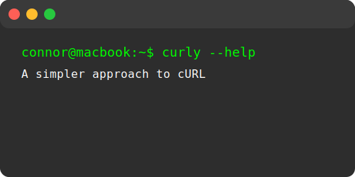

# Curly



A command-line tool for making HTTP requests simpler and more intuitive. Think of `curly` as a modern alternative to `curl` - a light wrapper around `fetch` in Node.js with curl-like syntax, plus built-in load testing capabilities.

## Quick Demo

### Curl Endpoints

```sh
curly https://api.example.com/users/1
```

```json
{
  "id": 1,
  "name": "John Doe",
  "email": "john@example.com"
}
```

### Load Testing

```sh
curly -n 5000 -c 50 https://api.example.com/posts
```

```
Summary:
  Total:         10.5208 secs
  Slowest:       0.3903 secs
  Fastest:       0.0964 secs
  Average:       0.1631 secs
  Requests/sec:  475.2479

Response time histogram:
  0.096 [ 605]  |■■■■■■■■■■■■■■
  0.126 [1741]  |■■■■■■■■■■■■■■■■■■■■■■■■■■■■■■■■■■■■■■■■
  0.155 [1278]  |■■■■■■■■■■■■■■■■■■■■■■■■■■■■■
  0.185 [1200]  |■■■■■■■■■■■■■■■■■■■■■■■■■■■■
  0.214 [  76]  |■■
  0.243 [  22]  |■
  0.273 [   5]  |
  0.302 [  29]  |■
  0.332 [   8]  |
  0.361 [  36]  |■

Latency distribution:
  10% in 0.1238 secs
  25% in 0.1352 secs
  50% in 0.1647 secs
  75% in 0.1888 secs
  90% in 0.2010 secs
  99% in 0.3278 secs

Status code distribution:
  [201] 5000 responses
```

## Features

- **Simple JSON Posting**: Automatically sets `Content-Type`: `application/json` if you're posting data.
- **Automatic Content-Type Parsing**: Tries to parse JSON responses by default. This makes it easier to make requests to JSON APIs or HTML documents without having to specify `Content-Type` headers.
- **Load Testing**: Built-in load testing with automatic mode detection. Fire off multiple concurrent requests and get detailed performance statistics including response time histograms.
- **Helper Flags** (like `--help`, `--verbose`, `--include`) for easier debugging and data introspection.
- **Familiar options**: Mimics curl-style flags (`-X`, `-H`, `-d`, `-I`) for easy migration from curl.
- **Pretty Printing**: The CLI automatically pretty prints the output for you, and groups response data into easily viewable chunks.
- **Viewing history**: Easily view history of commands you have written.

## Installation

There are two main ways to install curly: globally via npm (for everyday usage) or by "linking" locally for development.

### Global Installation

- Ensure you have Node >= 20 installed.
- Run `npm install -g @cwl/curly`
- Verify that curly is installed `curly --help`

### Linking

If you're developing `curly` and want to test your changes without publishing:

- Clone or download this repository.
- Install dependencies `npm install`
- Build the CLI `npm run build`
- Create a symlink in your global `npm` bin folder: `npm link`
- Confirm the CLI is now accessible: `which curly`

## Usage

```sh
Usage: curly [OPTIONS] <url>
```

### Options

| Option          | Short | Description                                                             |
| --------------- | ----- | ----------------------------------------------------------------------- |
| `--help`        | `-h`  | Display help information                                                |
| `--method`      | `-X`  | HTTP method (GET, POST, PUT, DELETE, etc.)                              |
| `--headers`     | `-H`  | Add custom headers (can be used multiple times)                         |
| `--data`        | `-d`  | Send data as key=value pairs or from file with @filename                |
| `--data-raw`    |       | Send raw JSON data                                                      |
| `--query`       | `-q`  | Add query parameters (can be used multiple times)                       |
| `--cookie`      | `-b`  | Send cookies (file path or key=value pairs, can be used multiple times) |
| `--cookie-jar`  |       | Save received cookies to a file                                         |
| `--output`      | `-o`  | Write response to a file                                                |
| `--include`     | `-i`  | Include response headers in output                                      |
| `--head`        | `-I`  | Send HEAD request (headers only)                                        |
| `--verbose`     | `-v`  | Show detailed request/response information                              |
| `--quiet`       |       | Suppress status line (for piping output)                                |
| `--history`     |       | View command history                                                    |
| `--requests`    | `-n`  | Number of requests for load testing (auto-detects load test mode)       |
| `--concurrency` | `-c`  | Concurrency level for load testing (auto-detects load test mode)        |
| `--timeout`     | `-t`  | Request timeout in milliseconds (aborts if exceeded)                    |
| `--follow`      | `-L`  | Follow HTTP redirects (disabled by default)                             |
| `--max-redirects` |     | Maximum number of redirects to follow (default: 20, requires --follow)  |
| `--fail`        | `-f`  | Exit with code 22 on HTTP errors (4xx/5xx)                              |
| `--user`        | `-u`  | Basic authentication credentials (user:password)                        |

### Examples

#### Basic Requests

##### Simple GET request (default method)

```sh
curly https://jsonplaceholder.typicode.com/posts/1
```

##### POST request with method flag

```sh
curly -X POST https://jsonplaceholder.typicode.com/posts
```

##### PUT request

```sh
curly -X PUT https://jsonplaceholder.typicode.com/posts/1
```

##### DELETE request

```sh
curly -X DELETE https://jsonplaceholder.typicode.com/posts/1
```

#### Working with Headers

##### Add custom headers

```sh
curly -H "Accept: application/json" -H "X-Custom-Header: my-value" https://jsonplaceholder.typicode.com/posts/1
```

##### Include response headers in output

```sh
curly -i https://jsonplaceholder.typicode.com/posts/1
```

##### HEAD request (headers only, no body)

```sh
curly -I https://jsonplaceholder.typicode.com/posts/1
# OR
curly --head https://jsonplaceholder.typicode.com/posts/1
```

#### Sending Data

##### POST JSON data using key=value pairs (automatically converted to JSON)

```sh
curly -X POST -d title=foo -d body=bar -d userId=1 https://jsonplaceholder.typicode.com/posts
# Sends: {"title": "foo", "body": "bar", "userId": "1"}
```

##### POST raw JSON data

```sh
curly -X POST --data-raw '{"title": "foo", "body": "bar", "userId": 1}' https://jsonplaceholder.typicode.com/posts
```

##### Multiple data fields

```sh
curly -X POST -d title="My Post" -d body="Post content" -d userId=1 https://jsonplaceholder.typicode.com/posts
```

##### POST data from a file

For complex payloads, store your JSON in a file and reference it with `@`:

```sh
# payload.json
# {"title": "My Post", "body": "This came from a file!", "userId": 1}

curly -X POST -d @payload.json https://jsonplaceholder.typicode.com/posts
```

Content-Type is automatically detected from the file extension (`.json` → `application/json`, `.xml` → `application/xml`, etc.).

#### Query Parameters

##### Add query parameters using URL

```sh
curly https://jsonplaceholder.typicode.com/posts?userId=1&completed=true
```

##### Add query parameters using flags

```sh
curly -q userId=1 -q completed=true https://jsonplaceholder.typicode.com/posts
```

#### Cookie Management

##### Send cookies as key=value pairs

```sh
curly -b sessionId=abc123 -b userId=456 https://jsonplaceholder.typicode.com/posts/1
# Sends Cookie header: sessionId=abc123; userId=456
```

##### Send cookies from a file

```sh
# Reads cookies from a JSON or Netscape format file
curly -b ./cookies.txt https://example.com/api
```

##### Save received cookies to a jar file

```sh
curly --cookie-jar ./cookies.json https://example.com/login
```

##### Send and save cookies in one request

```sh
curly -b sessionId=old123 --cookie-jar ./new-cookies.json https://example.com/refresh
```

**Note:** Unlike curl which uses `-c` for cookie jar, curly uses `--cookie-jar` for clarity

#### Output Options

##### Save response to a file

```sh
curly -o ./response.json https://jsonplaceholder.typicode.com/posts/1
```

##### Quiet mode (suppress status line for piping)

```sh
curly --quiet https://jsonplaceholder.typicode.com/posts/1 | jq .title
```

#### Load Testing

Load testing mode is automatically detected when `-n` or `-c` flags are present.

##### Basic load test

```sh
curly -n 100 -c 10 https://jsonplaceholder.typicode.com/posts/1
```

##### Load test with POST data

```sh
curly -n 50 -c 5 -X POST -d title=test -d body=content -d userId=1 https://jsonplaceholder.typicode.com/posts
```

##### High concurrency load test

```sh
curly -n 1000 -c 50 https://jsonplaceholder.typicode.com/users
```

#### Verbose Output and History

##### Enable verbose mode (shows detailed request/response information)

```sh
curly --verbose https://jsonplaceholder.typicode.com/posts/1
# OR use the short form
curly -v https://jsonplaceholder.typicode.com/posts/1
```

##### View command history

```sh
curly --history
```

- History is automatically saved to `~/curly_history.txt`

#### Timeout

##### Set a request timeout (in milliseconds)

```sh
curly --timeout 5000 https://api.example.com/slow-endpoint
# OR
curly -t 5000 https://api.example.com/slow-endpoint
```

If the request takes longer than 5 seconds, it will be aborted and an error will be shown.

##### Timeout with POST request

```sh
curly -t 3000 -X POST -d title=test https://api.example.com/posts
```

#### Following Redirects

By default, curly does not follow HTTP redirects (matching curl's behavior). Use `--follow` or `-L` to enable redirect following.

##### Follow redirects

```sh
curly --follow https://example.com/redirect
# OR
curly -L https://example.com/redirect
```

##### Limit maximum redirects

```sh
curly -L --max-redirects 5 https://example.com/redirect
```

If the redirect chain exceeds the limit, an error will be thrown. The default limit when using `--follow` is 20 redirects.

##### Follow redirects with other options

```sh
curly -L -i https://example.com/redirect  # Include headers in output
curly -L -t 5000 https://example.com/redirect  # With timeout
```

#### Fail on HTTP Errors

Use `--fail` or `-f` to exit with code 22 when the server returns a 4xx or 5xx status. Useful for scripts and CI pipelines.

##### Basic fail check

```sh
curly -f https://api.example.com/health || echo "Health check failed"
```

##### Fail with verbose output

```sh
curly -f -v https://api.example.com/protected
```

#### Basic Authentication

Use `-u` or `--user` to authenticate with HTTP Basic auth. Credentials are automatically base64 encoded.

##### Simple basic auth

```sh
curly -u admin:secret https://api.example.com/protected
```

##### Basic auth with environment variables

```sh
curly -u "$API_USER:$API_PASS" https://api.example.com/protected
```

##### Basic auth with other options

```sh
curly -u admin:secret -H "Accept: application/json" https://api.example.com/users
```

#### Complex Examples

##### GET request with query parameters

```sh
curly -q userId=1 https://jsonplaceholder.typicode.com/posts
```

##### GET nested resource (comments for a post)

```sh
curly https://jsonplaceholder.typicode.com/posts/1/comments
```

##### GET with multiple query parameters

```sh
curly -q postId=1 -q id=1 https://jsonplaceholder.typicode.com/comments
```

##### POST with JSON data (key=value pairs)

```sh
curly -X POST \
  -d title="My New Post" \
  -d body="This is the content" \
  -d userId=1 \
  https://jsonplaceholder.typicode.com/posts
```

##### POST with raw JSON data

```sh
curly -X POST \
  --data-raw '{"title": "My New Post", "body": "This is the content", "userId": 1}' \
  https://jsonplaceholder.typicode.com/posts
```

##### PUT request (update existing resource)

```sh
curly -X PUT \
  -d id=1 \
  -d title="Updated Title" \
  -d body="Updated body content" \
  -d userId=1 \
  https://jsonplaceholder.typicode.com/posts/1
```

##### PATCH request (partial update)

```sh
curly -X PATCH \
  -d title="Only Update Title" \
  https://jsonplaceholder.typicode.com/posts/1
```

##### DELETE resource

```sh
curly -X DELETE https://jsonplaceholder.typicode.com/posts/1
```

##### GET with custom headers

```sh
curly -H "Accept: application/json" \
  -H "X-Custom-Header: my-value" \
  https://jsonplaceholder.typicode.com/posts/1
```

##### GET with headers and query parameters

```sh
curly -H "Accept: application/json" \
  -q userId=1 \
  https://jsonplaceholder.typicode.com/posts
```

##### POST with headers and data

```sh
curly -X POST \
  -H "Content-Type: application/json" \
  -H "X-Request-ID: 12345" \
  -d title="New Post" \
  -d body="Post body" \
  -d userId=1 \
  https://jsonplaceholder.typicode.com/posts
```

##### GET headers only (HEAD request)

```sh
curly -I https://jsonplaceholder.typicode.com/posts/1
```

##### GET with included response headers

```sh
curly -i https://jsonplaceholder.typicode.com/posts/1
```

##### Save response to file

```sh
curly -o ./post.json https://jsonplaceholder.typicode.com/posts/1
```

##### GET user's posts and albums

```sh
# Get all posts by user 1
curly -q userId=1 https://jsonplaceholder.typicode.com/posts

# Get all albums by user 1
curly -q userId=1 https://jsonplaceholder.typicode.com/albums
```

##### GET photos from an album

```sh
curly -q albumId=1 https://jsonplaceholder.typicode.com/photos
```

##### GET todos for a user

```sh
curly -q userId=1 https://jsonplaceholder.typicode.com/todos
```

##### POST and save response to file

```sh
curly -X POST \
  -d title="Test Post" \
  -d body="Test body" \
  -d userId=1 \
  -o ./new-post.json \
  https://jsonplaceholder.typicode.com/posts
```

##### Verbose mode to see request details

```sh
curly -v https://jsonplaceholder.typicode.com/posts/1
```

##### Load test a specific endpoint

```sh
# Test GET endpoint
curly -n 100 -c 10 https://jsonplaceholder.typicode.com/posts/1

# Test POST endpoint with data
curly -n 50 -c 5 -X POST \
  -d title="Load Test" \
  -d body="Testing" \
  -d userId=1 \
  https://jsonplaceholder.typicode.com/posts
```
